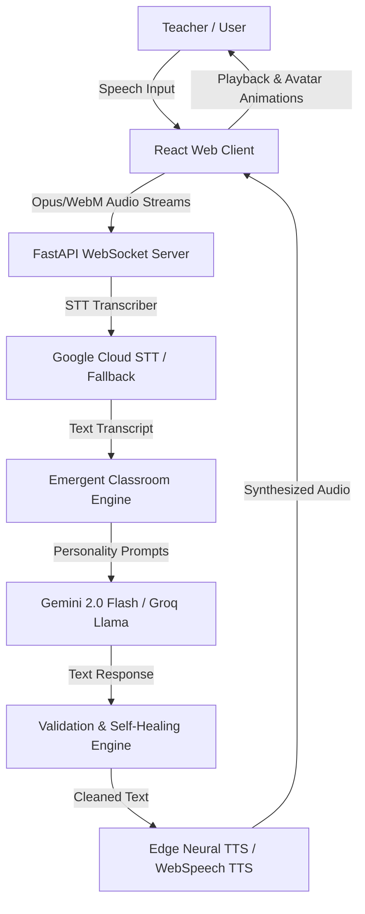

# 🏫 Future Classroom Simulator

[](https://fastapi.tiangolo.com/)
[](https://reactjs.org/)
[](https://www.typescriptlang.org/)
[](https://deepmind.google/technologies/gemini/)
[](https://opensource.org/licenses/MIT)

An advanced, high-fidelity teacher training simulator designed for B.Ed students. Rather than relying on rigid, pre-scripted timelines, the **Future Classroom Simulator** implements an **Emergent Classroom Engine (ECE)** that models realistic student psychological states, dynamic classroom environmental dynamics, and a dual-tier relationship matrix in real-time.

---

## 📖 Problem Statement & Pedagogical Solution

### The Problem
Traditional teacher training programs (like B.Ed) rely heavily on theoretical lectures or live micro-teaching sessions. Live micro-teaching is resource-intensive and struggles to realistically replicate difficult student behaviors (such as persistent confusion, distraction, ADHD/hyperactivity, or vocal disruption) in a controlled, safe environment.

### The Solution
The **Future Classroom Simulator** provides a safe sandbox for student teachers to hone their classroom management, pacing, and pedagogical scaffolding skills. 
- **Emergent Behavior**: Students behave as independent agents with shifting parameters for Attention, Confidence, Understanding, Confusion, and Curiosity.
- **Realistic Pedagogy**: Evaluates and scores teacher performance against real B.Ed training rubrics, providing evidence-based performance feedback.

---

## 🚀 Key Features

*   **Emergent Classroom Engine (ECE)**: Models individual student states using momentum-based evolution equations, ensuring smooth transitions rather than abrupt state jumps.
*   **Dual-Tier Memory System**: Student agents remember past teacher questions and interactions, building a persistent affinity (relationship matrix) towards the teacher.
*   **Validation & Self-Healing Engine**: Automatically detects repetitive answers or loops (using Jaccard similarity) and corrects them on-the-fly to ensure stable simulation behavior.
*   **Dual-Channel Resiliency (Failsafe Modes)**:
    *   **STT**: Seamlessly falls back to manual text input or REST-based audio uploads if the WebSockets connection fails.
    *   **TTS**: Falls back to the browser's native Web Speech API (`SpeechSynthesis`) if the high-fidelity Edge Neural TTS backend times out or fails.
*   **Telemetry Dashboard**: A collapsible side-panel displaying real-time metrics for speech recognition, LLM reasoning, speech synthesis, and process latency.
*   **Humanization Layer**: Injects hesitation markers (e.g., *"Umm..."*, *"Ah..."*), incomplete thoughts, and confidence-based voice tones to make student replies sound realistic.

---

## 🛠️ Tech Stack

- **Backend**: FastAPI, SQLite (persistence for session checkpoints), SQLAlchemy, `google-genai` (Gemini API SDK), `edge-tts` (High-fidelity neural TTS).
- **Frontend**: React 18, Vite, TypeScript, Web Audio API, Web Speech API (native recognition/synthesis fallbacks).
- **Styling**: Tailwind-free Vanilla CSS featuring a premium dark glassmorphic layout, micro-interactions, responsive grids, and visual micro-expression badges.

---

## 🗺️ System Architecture Overview



---

## 🎭 Prebuilt Demo Scenarios

The simulator includes 6 pre-configured scenarios that inject baseline state overrides to stress-test teacher capabilities:

| Scenario Code | Title | Description | Baseline Adjustments |
|---|---|---|---|
| `normal` | **Normal Class** | A standard balanced classroom baseline. | Standard student personality attributes. |
| `low_attention` | **Low Attention** | Students start highly distracted, checking phones or daydreaming. | Attention clamped to `25%` globally. |
| `high_confusion` | **High Confusion** | A difficult concept has been introduced; students need heavy scaffolding. | Confusion set to `80%`, Understanding to `25%`. |
| `noisy` | **Noisy Classroom** | A chaotic environment with high ambient noise and chatter. | Attention at `45%`, Confusion at `40%`, High class noise. |
| `hyperactive` | **Hyperactive Class** | High-energy students (e.g., Ishaan and Kabir) interrupt and query constantly. | Curiosity and Interrupt probability raised by `+30%`. |
| `time_pressure` | **Time Pressure** | Fast-paced session simulation with high cognitive load. | Attention at `65%`, Confusion at `30%`. |

---

## 💻 Setup & Run Instructions

### Prerequisites
- Python 3.10+
- Node.js 18+
- A Google Gemini API Key

### Backend Setup
1. Navigate to the backend directory:
   ```bash
   cd backend
   ```
2. Create and activate a Python virtual environment:
   ```bash
   python3 -m venv venv
   source venv/bin/activate
   ```
3. Install dependencies:
   ```bash
   pip install -r requirements.txt
   ```
4. Configure environment variables (create a `.env` file in the root using `.env.example` as a template):
   ```bash
   export GEMINI_API_KEY="your_api_key_here"
   ```
5. Start the development server:
   ```bash
   python3 -m uvicorn main:app --host 0.0.0.0 --port 8000
   ```

### Frontend Setup
1. Navigate to the frontend directory:
   ```bash
   cd frontend
   ```
2. Install npm modules:
   ```bash
   npm install
   ```
3. Start the Vite development server:
   ```bash
   npm run dev
   ```
4. Access the simulator at `http://localhost:5173`.

---

## 📋 Environment Variables Reference

| Variable | Required | Default | Description |
|---|---|---|---|
| `GEMINI_API_KEY` | **Yes** | None | Your Google Gemini API Key, used for generating intelligent student agent responses. |
| `GROQ_API_KEY` | No | None | Optional fallback key for Groq Cloud API. |
| `OLLAMA_BASE_URL`| No | None | Optional base URL for running local LLMs (e.g., `http://localhost:11434`). |
| `DATABASE_URL` | No | `sqlite:///./classroom.db` | SQLAlchemy connection string. Defaults to a local SQLite database. |
| `VITE_API_URL` | No | `http://localhost:8000` | Frontend build configuration variable mapping to the backend API URL. |

---

## 📜 License
This project is licensed under the **MIT License** - see the [LICENSE](file:///Users/govind/.gemini/antigravity/scratch/future-classroom-simulator/LICENSE) file for details.
